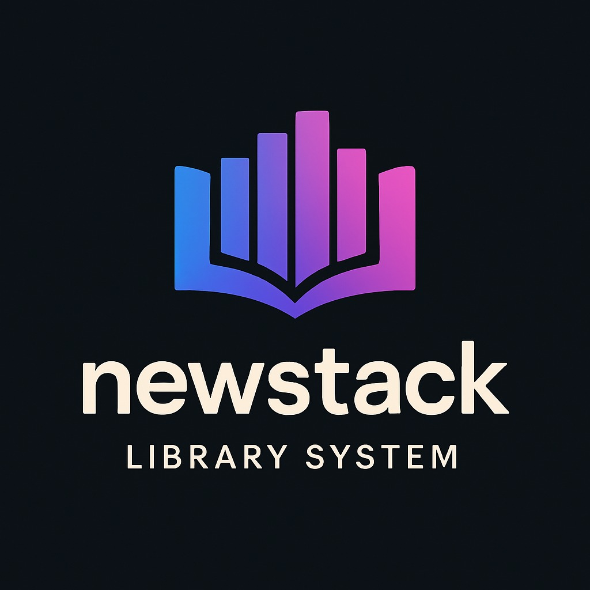

# NewStack - Sistema de Gerenciamento de Biblioteca



##  resumo

O NewStack é uma aplicação web completa para gerenciamento de bibliotecas, desenvolvida para modernizar e simplificar a administração de livros, clientes e empréstimos. A plataforma oferece uma interface intuitiva e responsiva para três perfis de usuários: Clientes, Funcionários e Administradores, cada um com um painel e permissões específicas para suas funções.

O sistema permite o cadastro detalhado de livros, com integração à API do Google Books para preenchimento automático de informações como autor, editora e capa. Possui um robusto sistema de autenticação e autorização baseado em roles, garantindo a segurança dos dados e o controle de acesso às funcionalidades. Além disso, utiliza um sistema de mensageria com RabbitMQ para o envio de notificações assíncronas, como confirmações de empréstimo.

## ✨ Funcionalidades Principais

* **Autenticação e Autorização:** Sistema de login seguro com gerenciamento de sessão e controle de acesso baseado em papéis (Cliente, Funcionário, Administrador).
* **Gerenciamento de Livros:** CRUD completo de livros, com busca de dados na API do Google Books para facilitar o cadastro.
* **Gerenciamento de Clientes:** Cadastro, visualização e edição de perfis de clientes.
* **Gerenciamento de Funcionários:** Módulo para administradores gerenciarem os funcionários do sistema.
* **Sistema de Empréstimos:** Registro de empréstimos, controle de devoluções e status (Emprestado, Devolvido, Atrasado, etc.).
* **Notificações por E-mail:** Envio de e-mails assíncronos para confirmação de empréstimos e devoluções.
* **Interface Web:** Páginas dinâmicas construídas com Thymeleaf e Bootstrap, oferecendo uma experiência de usuário agradável.

## 🚀 Tecnologias Utilizadas

O projeto foi construído utilizando um conjunto de tecnologias modernas e robustas, focadas em performance e escalabilidade.

* **Backend:**
    * Java 17+
    * Spring Boot 3
    * Spring Security (com JWT para autenticação)
    * Spring Data JPA (Hibernate)
    * Spring AMQP (RabbitMQ)
    * Spring Mail
* **Frontend:**
    * HTML5 / CSS3
    * JavaScript
    * Thymeleaf
    * Bootstrap 5
* **Banco de Dados:**
    * MySQL
* **Build e Gerenciamento de Dependências:**
    * Apache Maven
* **APIs Externas:**
    * Google Books API
* **Documentação da API:**
    * Swagger (OpenAPI)

## ⚙️ Instalação e Execução

Para executar o projeto em seu ambiente local, siga os passos abaixo.

### Pré-requisitos

* **Java Development Kit (JDK):** Versão 17 ou superior.
* **Apache Maven:** Para compilação e gerenciamento de dependências.
* **MySQL:** Um servidor de banco de dados MySQL em execução.
* **RabbitMQ:** Um servidor RabbitMQ em execução para o sistema de mensageria.

### Passo a Passo

1.  **Clone o repositório:**
    ```bash
    git clone [https://github.com/arkyndevelop/newstack.git](https://github.com/arkyndevelop/newstack.git)
    cd newstack
    ```

2.  **Crie o Banco de Dados:**
    * Acesse seu servidor MySQL e crie um novo banco de dados.
    * Exemplo: `CREATE DATABASE newstack_db;`

3.  **Configure a Conexão:**
    * Abra o arquivo `src/main/resources/application.properties`.
    * Descomente e edite uma das seções de configuração de banco de dados com suas credenciais:
        ```properties
        spring.datasource.url=jdbc:mysql://localhost:3306/newstack_db
        spring.datasource.username=${SEU_USUÁRIO}
        spring.datasource.password=${SUA_SENHA}
        spring.jpa.hibernate.ddl-auto=update
        ```

4.  **Configure o RabbitMQ e E-mail:**
    * No mesmo arquivo `application.properties`, verifique se as configurações do RabbitMQ e do serviço de e-mail estão corretas para o seu ambiente local.
        ```properties
        # RabbitMQ Configuration
        spring.rabbitmq.host=localhost
        spring.rabbitmq.port=5672
        spring.rabbitmq.username=guest
        spring.rabbitmq.password=guest

        # E-mail Configuration
        spring.mail.host=smtp.gmail.com
        spring.mail.port=587
        spring.mail.username=seu-email@gmail.com
        spring.mail.password=sua-senha-de-app-gmail
        ```

5.  **Compile e Execute a Aplicação:**
    * Utilize o Maven Wrapper para compilar e executar o projeto:
        ```bash
        ./mvnw spring-boot:run
        ```
    * A aplicação estará disponível em `http://localhost:8080`.

## 🔮 Próximas Features

* [ ] **Módulo de Relatórios Avançados:** Implementar uma seção de relatórios para administradores com gráficos e estatísticas sobre empréstimos, livros mais populares e atividade dos usuários.
* [ ] **Sistema de Reservas:** Permitir que clientes reservem livros que estão atualmente emprestados, criando uma fila de espera.
* [ ] **Notificações de Atraso:** Enviar e-mails automáticos para clientes com empréstimos atrasados.
* [ ] **Testes Unitários e de Integração:** Aumentar a cobertura de testes para garantir a estabilidade e a qualidade do código.
* [ ] **Deploy em Nuvem:** Criar scripts e configurações para facilitar o deploy da aplicação em serviços de nuvem como AWS ou Heroku.
